Employee\_Attrition\_Prediction
================
Michael Mazel
3/24/2021

``` r
library(tidyr)
library(dplyr)
```

    ## 
    ## Attaching package: 'dplyr'

    ## The following objects are masked from 'package:stats':
    ## 
    ##     filter, lag

    ## The following objects are masked from 'package:base':
    ## 
    ##     intersect, setdiff, setequal, union

``` r
library(PerformanceAnalytics)
```

    ## Warning: package 'PerformanceAnalytics' was built under R version 4.0.4

    ## Loading required package: xts

    ## Loading required package: zoo

    ## 
    ## Attaching package: 'zoo'

    ## The following objects are masked from 'package:base':
    ## 
    ##     as.Date, as.Date.numeric

    ## 
    ## Attaching package: 'xts'

    ## The following objects are masked from 'package:dplyr':
    ## 
    ##     first, last

    ## 
    ## Attaching package: 'PerformanceAnalytics'

    ## The following object is masked from 'package:graphics':
    ## 
    ##     legend

``` r
library(pivottabler)
```

    ## Warning: package 'pivottabler' was built under R version 4.0.4

``` r
library(ggplot2)
```

Import data

``` r
employee <- read.csv(file = 'Data_Sets\\CaseStudy2-data.csv', header = T)
```

# Data Exploration of Quantitative Variables

Check for null values and see variable types

``` r
colSums(is.na(employee))
```

    ##                       ID                      Age                Attrition 
    ##                        0                        0                        0 
    ##           BusinessTravel                DailyRate               Department 
    ##                        0                        0                        0 
    ##         DistanceFromHome                Education           EducationField 
    ##                        0                        0                        0 
    ##            EmployeeCount           EmployeeNumber  EnvironmentSatisfaction 
    ##                        0                        0                        0 
    ##                   Gender               HourlyRate           JobInvolvement 
    ##                        0                        0                        0 
    ##                 JobLevel                  JobRole          JobSatisfaction 
    ##                        0                        0                        0 
    ##            MaritalStatus            MonthlyIncome              MonthlyRate 
    ##                        0                        0                        0 
    ##       NumCompaniesWorked                   Over18                 OverTime 
    ##                        0                        0                        0 
    ##        PercentSalaryHike        PerformanceRating RelationshipSatisfaction 
    ##                        0                        0                        0 
    ##            StandardHours         StockOptionLevel        TotalWorkingYears 
    ##                        0                        0                        0 
    ##    TrainingTimesLastYear          WorkLifeBalance           YearsAtCompany 
    ##                        0                        0                        0 
    ##       YearsInCurrentRole  YearsSinceLastPromotion     YearsWithCurrManager 
    ##                        0                        0                        0

``` r
str(employee)
```

    ## 'data.frame':    870 obs. of  36 variables:
    ##  $ ID                      : int  1 2 3 4 5 6 7 8 9 10 ...
    ##  $ Age                     : int  32 40 35 32 24 27 41 37 34 34 ...
    ##  $ Attrition               : chr  "No" "No" "No" "No" ...
    ##  $ BusinessTravel          : chr  "Travel_Rarely" "Travel_Rarely" "Travel_Frequently" "Travel_Rarely" ...
    ##  $ DailyRate               : int  117 1308 200 801 567 294 1283 309 1333 653 ...
    ##  $ Department              : chr  "Sales" "Research & Development" "Research & Development" "Sales" ...
    ##  $ DistanceFromHome        : int  13 14 18 1 2 10 5 10 10 10 ...
    ##  $ Education               : int  4 3 2 4 1 2 5 4 4 4 ...
    ##  $ EducationField          : chr  "Life Sciences" "Medical" "Life Sciences" "Marketing" ...
    ##  $ EmployeeCount           : int  1 1 1 1 1 1 1 1 1 1 ...
    ##  $ EmployeeNumber          : int  859 1128 1412 2016 1646 733 1448 1105 1055 1597 ...
    ##  $ EnvironmentSatisfaction : int  2 3 3 3 1 4 2 4 3 4 ...
    ##  $ Gender                  : chr  "Male" "Male" "Male" "Female" ...
    ##  $ HourlyRate              : int  73 44 60 48 32 32 90 88 87 92 ...
    ##  $ JobInvolvement          : int  3 2 3 3 3 3 4 2 3 2 ...
    ##  $ JobLevel                : int  2 5 3 3 1 3 1 2 1 2 ...
    ##  $ JobRole                 : chr  "Sales Executive" "Research Director" "Manufacturing Director" "Sales Executive" ...
    ##  $ JobSatisfaction         : int  4 3 4 4 4 1 3 4 3 3 ...
    ##  $ MaritalStatus           : chr  "Divorced" "Single" "Single" "Married" ...
    ##  $ MonthlyIncome           : int  4403 19626 9362 10422 3760 8793 2127 6694 2220 5063 ...
    ##  $ MonthlyRate             : int  9250 17544 19944 24032 17218 4809 5561 24223 18410 15332 ...
    ##  $ NumCompaniesWorked      : int  2 1 2 1 1 1 2 2 1 1 ...
    ##  $ Over18                  : chr  "Y" "Y" "Y" "Y" ...
    ##  $ OverTime                : chr  "No" "No" "No" "No" ...
    ##  $ PercentSalaryHike       : int  11 14 11 19 13 21 12 14 19 14 ...
    ##  $ PerformanceRating       : int  3 3 3 3 3 4 3 3 3 3 ...
    ##  $ RelationshipSatisfaction: int  3 1 3 3 3 3 1 3 4 2 ...
    ##  $ StandardHours           : int  80 80 80 80 80 80 80 80 80 80 ...
    ##  $ StockOptionLevel        : int  1 0 0 2 0 2 0 3 1 1 ...
    ##  $ TotalWorkingYears       : int  8 21 10 14 6 9 7 8 1 8 ...
    ##  $ TrainingTimesLastYear   : int  3 2 2 3 2 4 5 5 2 3 ...
    ##  $ WorkLifeBalance         : int  2 4 3 3 3 2 2 3 3 2 ...
    ##  $ YearsAtCompany          : int  5 20 2 14 6 9 4 1 1 8 ...
    ##  $ YearsInCurrentRole      : int  2 7 2 10 3 7 2 0 1 2 ...
    ##  $ YearsSinceLastPromotion : int  0 4 2 5 1 1 0 0 0 7 ...
    ##  $ YearsWithCurrManager    : int  3 9 2 7 3 7 3 0 0 7 ...

No null values found.

Select quantitative variables.

``` r
quant <- subset(employee, select=-c(BusinessTravel,Department,EducationField,Gender,JobRole,MaritalStatus,Over18,OverTime))
```

``` r
summary(quant)
```

    ##        ID             Age         Attrition           DailyRate     
    ##  Min.   :  1.0   Min.   :18.00   Length:870         Min.   : 103.0  
    ##  1st Qu.:218.2   1st Qu.:30.00   Class :character   1st Qu.: 472.5  
    ##  Median :435.5   Median :35.00   Mode  :character   Median : 817.5  
    ##  Mean   :435.5   Mean   :36.83                      Mean   : 815.2  
    ##  3rd Qu.:652.8   3rd Qu.:43.00                      3rd Qu.:1165.8  
    ##  Max.   :870.0   Max.   :60.00                      Max.   :1499.0  
    ##  DistanceFromHome   Education     EmployeeCount EmployeeNumber  
    ##  Min.   : 1.000   Min.   :1.000   Min.   :1     Min.   :   1.0  
    ##  1st Qu.: 2.000   1st Qu.:2.000   1st Qu.:1     1st Qu.: 477.2  
    ##  Median : 7.000   Median :3.000   Median :1     Median :1039.0  
    ##  Mean   : 9.339   Mean   :2.901   Mean   :1     Mean   :1029.8  
    ##  3rd Qu.:14.000   3rd Qu.:4.000   3rd Qu.:1     3rd Qu.:1561.5  
    ##  Max.   :29.000   Max.   :5.000   Max.   :1     Max.   :2064.0  
    ##  EnvironmentSatisfaction   HourlyRate     JobInvolvement     JobLevel    
    ##  Min.   :1.000           Min.   : 30.00   Min.   :1.000   Min.   :1.000  
    ##  1st Qu.:2.000           1st Qu.: 48.00   1st Qu.:2.000   1st Qu.:1.000  
    ##  Median :3.000           Median : 66.00   Median :3.000   Median :2.000  
    ##  Mean   :2.701           Mean   : 65.61   Mean   :2.723   Mean   :2.039  
    ##  3rd Qu.:4.000           3rd Qu.: 83.00   3rd Qu.:3.000   3rd Qu.:3.000  
    ##  Max.   :4.000           Max.   :100.00   Max.   :4.000   Max.   :5.000  
    ##  JobSatisfaction MonthlyIncome    MonthlyRate    NumCompaniesWorked
    ##  Min.   :1.000   Min.   : 1081   Min.   : 2094   Min.   :0.000     
    ##  1st Qu.:2.000   1st Qu.: 2840   1st Qu.: 8092   1st Qu.:1.000     
    ##  Median :3.000   Median : 4946   Median :14074   Median :2.000     
    ##  Mean   :2.709   Mean   : 6390   Mean   :14326   Mean   :2.728     
    ##  3rd Qu.:4.000   3rd Qu.: 8182   3rd Qu.:20456   3rd Qu.:4.000     
    ##  Max.   :4.000   Max.   :19999   Max.   :26997   Max.   :9.000     
    ##  PercentSalaryHike PerformanceRating RelationshipSatisfaction StandardHours
    ##  Min.   :11.0      Min.   :3.000     Min.   :1.000            Min.   :80   
    ##  1st Qu.:12.0      1st Qu.:3.000     1st Qu.:2.000            1st Qu.:80   
    ##  Median :14.0      Median :3.000     Median :3.000            Median :80   
    ##  Mean   :15.2      Mean   :3.152     Mean   :2.707            Mean   :80   
    ##  3rd Qu.:18.0      3rd Qu.:3.000     3rd Qu.:4.000            3rd Qu.:80   
    ##  Max.   :25.0      Max.   :4.000     Max.   :4.000            Max.   :80   
    ##  StockOptionLevel TotalWorkingYears TrainingTimesLastYear WorkLifeBalance
    ##  Min.   :0.0000   Min.   : 0.00     Min.   :0.000         Min.   :1.000  
    ##  1st Qu.:0.0000   1st Qu.: 6.00     1st Qu.:2.000         1st Qu.:2.000  
    ##  Median :1.0000   Median :10.00     Median :3.000         Median :3.000  
    ##  Mean   :0.7839   Mean   :11.05     Mean   :2.832         Mean   :2.782  
    ##  3rd Qu.:1.0000   3rd Qu.:15.00     3rd Qu.:3.000         3rd Qu.:3.000  
    ##  Max.   :3.0000   Max.   :40.00     Max.   :6.000         Max.   :4.000  
    ##  YearsAtCompany   YearsInCurrentRole YearsSinceLastPromotion
    ##  Min.   : 0.000   Min.   : 0.000     Min.   : 0.000         
    ##  1st Qu.: 3.000   1st Qu.: 2.000     1st Qu.: 0.000         
    ##  Median : 5.000   Median : 3.000     Median : 1.000         
    ##  Mean   : 6.962   Mean   : 4.205     Mean   : 2.169         
    ##  3rd Qu.:10.000   3rd Qu.: 7.000     3rd Qu.: 3.000         
    ##  Max.   :40.000   Max.   :18.000     Max.   :15.000         
    ##  YearsWithCurrManager
    ##  Min.   : 0.00       
    ##  1st Qu.: 2.00       
    ##  Median : 3.00       
    ##  Mean   : 4.14       
    ##  3rd Qu.: 7.00       
    ##  Max.   :17.00

Initial findings: performance ratings only fall between 3 and 4.
Employee count and standard hours returned only 1 unique value each.
Also, EmployeeNumber should not be used as a predictor in our model.

We will investigate feature similarities. First, check out features that
are likely related to pay.

``` r
quant2 <- quant %>% select(DailyRate,HourlyRate,MonthlyIncome,MonthlyRate,PercentSalaryHike,StockOptionLevel,Education,JobLevel)
chart.Correlation(quant2, histogram=TRUE, pch=19)
```

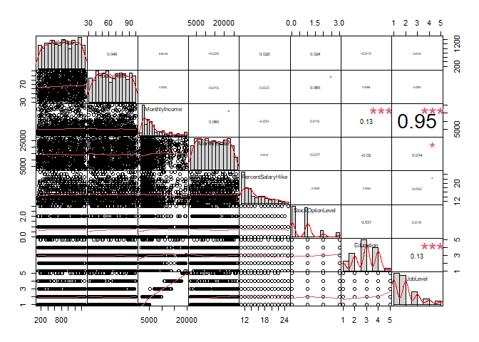<!-- -->

There aren’t any moderate or strong correlations between any of these
variables, except for Job Level and Monthly Income, with a massive .95
correlation. Next, let’s investigate time related variables

``` r
quant2 <- quant %>% select(Age,NumCompaniesWorked,TotalWorkingYears,TrainingTimesLastYear,YearsAtCompany,YearsSinceLastPromotion,YearsWithCurrManager)
chart.Correlation(quant2, histogram=TRUE, pch=19)
```

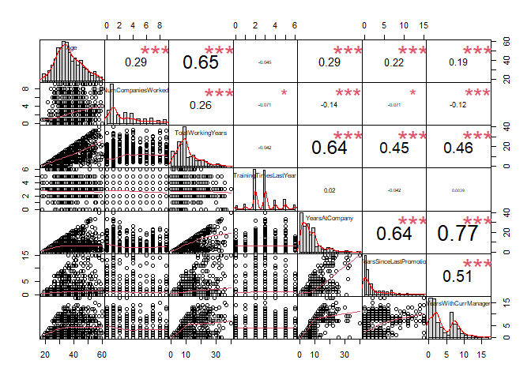<!-- -->

YearsWithCurrentManager produces a high correlation with YearsAtCompany.
This may be a redundant feature

``` r
quant2 <- quant %>% select(EnvironmentSatisfaction,JobInvolvement,JobSatisfaction,PerformanceRating,RelationshipSatisfaction,WorkLifeBalance,DistanceFromHome)
chart.Correlation(quant2, histogram=TRUE, pch=19)
```

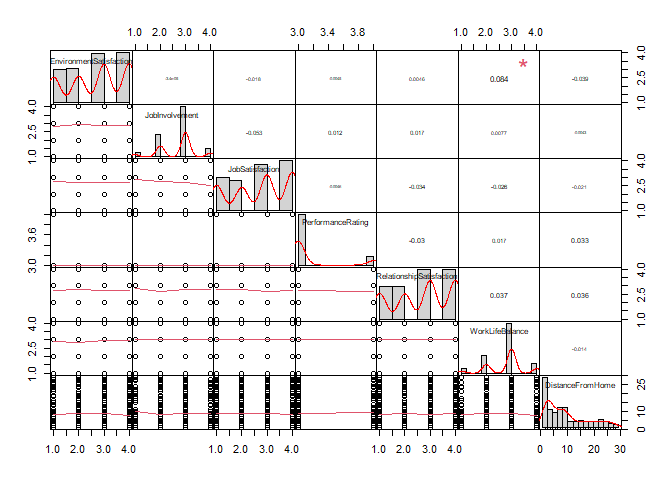<!-- -->

Surprisingly, there are minimal relationships between these variables.
Just to ensure we aren’t missing any relationships, we will investigate
all relationships and their correlations

``` r
quant2 <- subset(quant, select=-c(Attrition,ID,StandardHours,EmployeeCount))
chart.Correlation(quant2, histogram=F, pch=19)
```

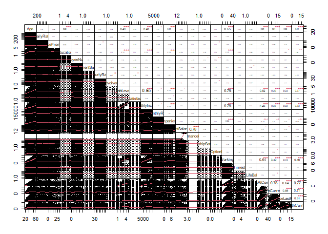<!-- -->

The highest correlation by far is still between Job Level and
MonthlyIncome

``` r
quant %>% group_by(Attrition) %>% summarise(count = n())
```

    ## `summarise()` ungrouping output (override with `.groups` argument)

    ## # A tibble: 2 x 2
    ##   Attrition count
    ##   <chr>     <int>
    ## 1 No          730
    ## 2 Yes         140

Having large disparity between the levels in the response variable
usually impacts a classification model’s accuracy. Specifically, the
level with the lower number of responses (in this case “Yes”) is
difficult to predict. We will address this by creating synthetic data
later with the ROSE package.

# Feature Selection

## Normalize Data

We will refer to the histograms above to normalize data if necessary. We
will focus on skewed variables that do not have limited number of
levels. I made a comment next to the transformation that I felt best
meet the linear regression assumptions

``` r
employee_norm <- employee %>% mutate(MonthlyIncomeLog = log(MonthlyIncome)) #best
employee_norm <- employee_norm %>% mutate(MonthlyIncomeSqrt = sqrt(MonthlyIncome))
employee_norm <- employee_norm %>% mutate(MonthlyIncomeCube = (MonthlyIncome)^(1/3))
employee_norm <- employee_norm %>% mutate(MonthlyIncomeRecip = 1/(MonthlyIncome))
par(mfrow=c(2,2))
hist(employee_norm$MonthlyIncomeLog)
hist(employee_norm$MonthlyIncomeSqrt)
hist(employee_norm$MonthlyIncomeCube)
hist(employee_norm$MonthlyIncomeRecip)
```

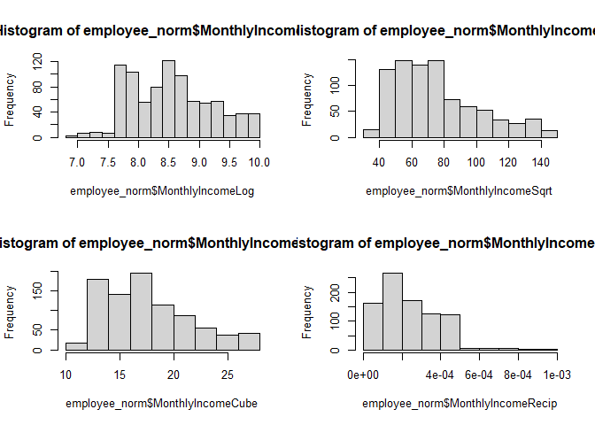<!-- -->

``` r
employee_norm <- employee %>% mutate(PercentSalaryHikeLog = log(PercentSalaryHike))
employee_norm <- employee_norm %>% mutate(PercentSalaryHikeSqrt = sqrt(PercentSalaryHike)) #best
employee_norm <- employee_norm %>% mutate(PercentSalaryHikeCube = (PercentSalaryHike)^(1/3))
employee_norm <- employee_norm %>% mutate(PercentSalaryHikeRecip = 1/(PercentSalaryHike))
par(mfrow=c(2,2))
hist(employee_norm$PercentSalaryHikeLog)
hist(employee_norm$PercentSalaryHikeSqrt)
hist(employee_norm$PercentSalaryHikeCube)
hist(employee_norm$PercentSalaryHikeRecip)
```

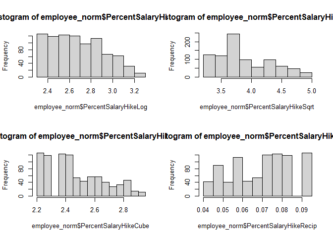<!-- -->

``` r
employee_norm <- employee %>% mutate(TotalWorkingYearsLog = log(TotalWorkingYears))
employee_norm <- employee_norm %>% mutate(TotalWorkingYearsSqrt = sqrt(TotalWorkingYears)) #best
par(mfrow=c(1,2))
hist(employee_norm$TotalWorkingYearsLog)
hist(employee_norm$TotalWorkingYearsSqrt)
```

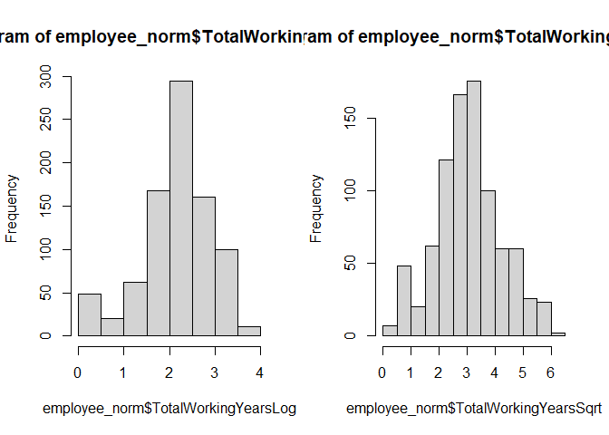<!-- -->

``` r
employee_norm <- employee %>% mutate(YearsWithCurrManagerLog = log(YearsWithCurrManager))
employee_norm <- employee_norm %>% mutate(YearsWithCurrManagerSqrt = sqrt(YearsWithCurrManager))
employee_norm <- employee_norm %>% mutate(YearsWithCurrManagerCube = (YearsWithCurrManager)^(1/3))
employee_norm <- employee_norm %>% mutate(YearsWithCurrManagerRecip = 1/(YearsWithCurrManager))
par(mfrow=c(2,2))
hist(employee_norm$YearsWithCurrManagerLog)
hist(employee_norm$YearsWithCurrManagerSqrt)
hist(employee_norm$YearsWithCurrManagerCube)
hist(employee_norm$YearsWithCurrManagerRecip)
```

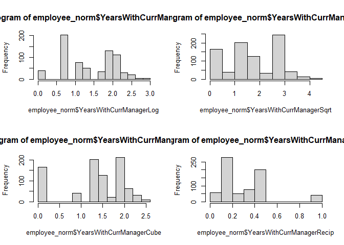<!-- -->

``` r
# none look great, we will keep as is
```

``` r
employee_norm <- employee %>% mutate(YearsSinceLastPromotionLog = log(YearsSinceLastPromotion))
employee_norm <- employee_norm %>% mutate(YearsSinceLastPromotionSqrt = sqrt(YearsSinceLastPromotion))
employee_norm <- employee_norm %>% mutate(YearsSinceLastPromotionCube = (YearsSinceLastPromotion)^(1/3))
employee_norm <- employee_norm %>% mutate(YearsSinceLastPromotionRecip = 1/(YearsSinceLastPromotion))
par(mfrow=c(2,2))
hist(employee_norm$YearsSinceLastPromotionLog)
hist(employee_norm$YearsSinceLastPromotionSqrt)
hist(employee_norm$YearsSinceLastPromotionCube)
hist(employee_norm$YearsSinceLastPromotionRecip)
```

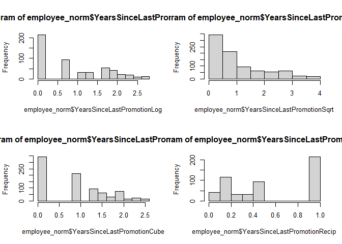<!-- -->

``` r
# none look great, we will keep as is
```

``` r
employee_norm <- employee %>% mutate(DistanceFromHomeLog = log(DistanceFromHome)) #best
employee_norm <- employee_norm %>% mutate(DistanceFromHomeSqrt = sqrt(DistanceFromHome))
employee_norm <- employee_norm %>% mutate(DistanceFromHomeCube = (DistanceFromHome)^(1/3))
employee_norm <- employee_norm %>% mutate(DistanceFromHomeRecip = 1/(DistanceFromHome))
par(mfrow=c(2,2))
hist(employee_norm$DistanceFromHomeLog)
hist(employee_norm$DistanceFromHomeSqrt)
hist(employee_norm$DistanceFromHomeCube)
hist(employee_norm$DistanceFromHomeRecip)
```

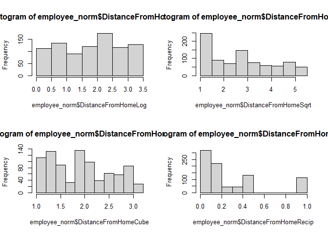<!-- -->

Add the transformed variables to our main df and remove the original
versions, along with employeeNumber and the single level features

``` r
quant <- quant %>% mutate(MonthlyIncomeLog = log(MonthlyIncome))
quant <- quant %>% mutate(PercentSalaryHikeSqrt = sqrt(PercentSalaryHike)) 
quant <- quant %>% mutate(TotalWorkingYearsSqrt = sqrt(TotalWorkingYears)) 
quant <- quant %>% mutate(DistanceFromHomeLog = log(DistanceFromHome))
quant <- subset(quant, select = -c(MonthlyIncome, PercentSalaryHike, TotalWorkingYears, DistanceFromHome, StandardHours, EmployeeCount, EmployeeNumber))
```

## Standardize/Scale Variables

``` r
quant_std <- quant
for(num in 4:25) {      
  quant_std[ , num] <- scale(quant_std[ , num])
}
quant_std$Age <- scale(quant_std$Age)
```

Perform a quick investigation of the differences in each of the
variables’ means according to the attrition group it belongs to.

``` r
aggregate(quant_std[, c(2,4:25)], list(quant_std$Attrition), FUN = mean)
```

    ##   Group.1         Age   DailyRate   Education EnvironmentSatisfaction
    ## 1      No  0.06538162  0.01479044  0.02163974              0.03384348
    ## 2     Yes -0.34091847 -0.07712160 -0.11283578             -0.17646959
    ##    HourlyRate JobInvolvement    JobLevel JobSatisfaction MonthlyRate
    ## 1 -0.01599889     0.08219269  0.07096325      0.04705935  0.01892169
    ## 2  0.08342279    -0.42857617 -0.37002266     -0.24538087 -0.09866310
    ##   NumCompaniesWorked PerformanceRating RelationshipSatisfaction
    ## 1        -0.02670651      -0.006711254               0.01735237
    ## 2         0.13925537       0.034994397              -0.09048024
    ##   StockOptionLevel TrainingTimesLastYear WorkLifeBalance YearsAtCompany
    ## 1       0.06507382            0.02745371      0.03929881     0.05635258
    ## 2      -0.33931348           -0.14315149     -0.20491523    -0.29383844
    ##   YearsInCurrentRole YearsSinceLastPromotion YearsWithCurrManager
    ## 1         0.06837188             0.002001633           0.06424308
    ## 2        -0.35651054            -0.010437088          -0.33498179
    ##   MonthlyIncomeLog PercentSalaryHikeSqrt TotalWorkingYearsSqrt
    ## 1       0.08693107          -0.005559401            0.09224249
    ## 2      -0.45328346           0.028988304           -0.48097869
    ##   DistanceFromHomeLog
    ## 1         -0.03006086
    ## 2          0.15674593

Variables that returned around a .1 difference or less between means
include: DailyRate, HourlyRate, MonthlyRate, PercentSalaryHikeSqrt,
PerformanceRating, YearsSinceLastPromotion. Therefore, these are likely
poor predictors of attrition, but we will keep them because our model
with automatically perform variable selection (e.g. bagging)

# Data Exploration of Categorical Variables

Check for unique levels of categorical variables. We will then dummy
code these to our dataframe

``` r
cat <- employee %>% select(Attrition,BusinessTravel,Department,EducationField,Gender,JobRole,MaritalStatus,Over18,OverTime,ID)
```

``` r
print("ATTRITION:")
```

    ## [1] "ATTRITION:"

``` r
unique(employee$Attrition)
```

    ## [1] "No"  "Yes"

``` r
print("BUS_TRAVEL:")
```

    ## [1] "BUS_TRAVEL:"

``` r
unique(employee$BusinessTravel)
```

    ## [1] "Travel_Rarely"     "Travel_Frequently" "Non-Travel"

``` r
print("DEPT:")
```

    ## [1] "DEPT:"

``` r
unique(employee$Department)
```

    ## [1] "Sales"                  "Research & Development" "Human Resources"

``` r
print("EDU:")
```

    ## [1] "EDU:"

``` r
unique(employee$EducationField)
```

    ## [1] "Life Sciences"    "Medical"          "Marketing"        "Technical Degree"
    ## [5] "Other"            "Human Resources"

``` r
print("GENDER:")
```

    ## [1] "GENDER:"

``` r
unique(employee$Gender)
```

    ## [1] "Male"   "Female"

``` r
print("JOB_ROLE:")
```

    ## [1] "JOB_ROLE:"

``` r
unique(employee$JobRole)
```

    ## [1] "Sales Executive"           "Research Director"        
    ## [3] "Manufacturing Director"    "Research Scientist"       
    ## [5] "Sales Representative"      "Healthcare Representative"
    ## [7] "Manager"                   "Human Resources"          
    ## [9] "Laboratory Technician"

``` r
print("MARRIED:")
```

    ## [1] "MARRIED:"

``` r
unique(employee$MaritalStatus)
```

    ## [1] "Divorced" "Single"   "Married"

``` r
print("Over18:")
```

    ## [1] "Over18:"

``` r
unique(employee$Over18)
```

    ## [1] "Y"

``` r
print("OVERTIME:")
```

    ## [1] "OVERTIME:"

``` r
unique(employee$OverTime)
```

    ## [1] "No"  "Yes"

Assess feature importance

``` r
# rename categories so they are more compact in the pivot table
cat$JobRole[cat$JobRole == "Sales Executive"] <- "SaleExec"
cat$JobRole[cat$JobRole == "Research Director"] <- "RsrDir"
cat$JobRole[cat$JobRole == "Manufacturing Director"] <- "ManDir"
cat$JobRole[cat$JobRole == "Research Scientist"] <- "RsrSci"
cat$JobRole[cat$JobRole == "Sales Representative"] <- "SaleRep"
cat$JobRole[cat$JobRole == "Healthcare Representative"] <- "HCRep"
cat$JobRole[cat$JobRole == "Manager"] <- "Mgr"
cat$JobRole[cat$JobRole == "Human Resources"] <- "HR"
cat$JobRole[cat$JobRole == "Laboratory Technician"] <- "LabTec"
cat$EducationField[cat$EducationField == "Life Sciences"] <- "LifeSci"
cat$EducationField[cat$EducationField == "Medical"] <- "Med"
cat$EducationField[cat$EducationField == "Marketing"] <- "Mktg"
cat$EducationField[cat$EducationField == "Technical Degree"] <- "TechDeg"
cat$EducationField[cat$EducationField == "Human Resources"] <- "HR"

# pivot tables
qpvt(cat, "Attrition", "BusinessTravel", "n()")
```

    ##        Non-Travel  Travel_Frequently  Travel_Rarely  Total  
    ## No             83                123            524    730  
    ## Yes            11                 35             94    140  
    ## Total          94                158            618    870

``` r
qpvt(cat, "Attrition", "Department", "n()")
```

    ##        Human Resources  Research & Development  Sales  Total  
    ## No                  29                     487    214    730  
    ## Yes                  6                      75     59    140  
    ## Total               35                     562    273    870

``` r
qpvt(cat, "Attrition", "EducationField", "n()")
```

    ##        HR  LifeSci  Med  Mktg  Other  TechDeg  Total  
    ## No     11      305  233    80     43       58    730  
    ## Yes     4       53   37    20      9       17    140  
    ## Total  15      358  270   100     52       75    870

``` r
qpvt(cat, "Attrition", "Gender", "n()")
```

    ##        Female  Male  Total  
    ## No        301   429    730  
    ## Yes        53    87    140  
    ## Total     354   516    870

``` r
qpvt(cat, "Attrition", "JobRole", "n()")
```

    ##        HCRep  HR  LabTec  ManDir  Mgr  RsrDir  RsrSci  SaleExec  SaleRep  Total  
    ## No        68  21     123      85   47      50     140       167       29    730  
    ## Yes        8   6      30       2    4       1      32        33       24    140  
    ## Total     76  27     153      87   51      51     172       200       53    870

``` r
qpvt(cat, "Attrition", "MaritalStatus", "n()")
```

    ##        Divorced  Married  Single  Total  
    ## No          179      352     199    730  
    ## Yes          12       58      70    140  
    ## Total       191      410     269    870

``` r
qpvt(cat, "Attrition", "Over18", "n()")
```

    ##        Y    Total  
    ## No     730    730  
    ## Yes    140    140  
    ## Total  870    870

``` r
qpvt(cat, "Attrition", "OverTime", "n()")
```

    ##        No   Yes  Total  
    ## No     558  172    730  
    ## Yes     60   80    140  
    ## Total  618  252    870

By comparing the proportions for either attrition level, we can estimate
feature importance per category.

Important: JobRole, MaritalStatus, OverTime Somewhat: BusinessTravel,
Department, EducationField Not so much: Gender  
Not all due, because only 1 level: Over18

We will combine categories to slim down the number of dummy variables
needed. If two categories can be logically clumped together (e.g. sales
rep and sales exec) and they produce similar proportions for attrition,
we will combine.

``` r
# EducationField
cat <- cat %>% mutate(EduMedLife = ifelse(grepl("LifeSci", cat$EducationField), 1, ifelse(grepl("Med", cat$EducationField), 1, 0)))
cat <- cat %>% mutate(EduMktg = ifelse(grepl("Mktg", cat$EducationField), 1,0))
cat <- cat %>% mutate(EduTech = ifelse(grepl("TechDeg", cat$EducationField), 1,0))
cat <- cat %>% mutate(EduOther = ifelse(grepl("Other", cat$EducationField), 1,0))
  # EducationField is the reference group
```

``` r
# JobRole
cat$JobDir <- 0
cat$JobDir[cat$JobRole == "ManDir" | cat$JobRole == "RsrDir"] <- 1

cat$JobResOrLab <- 0
cat$JobResOrLab[cat$JobRole == "LabTec" | cat$JobRole == "RsrSci"] <- 1

cat <- cat %>% mutate(JobMgr = ifelse(grepl("Mgr", cat$JobRole), 1,0))
cat <- cat %>% mutate(JobHCRep = ifelse(grepl("HCRep", cat$JobRole), 1,0))
cat <- cat %>% mutate(JobSaleRep = ifelse(grepl("SaleRep", cat$JobRole), 1,0))
cat <- cat %>% mutate(JobSaleExec = ifelse(grepl("SaleExec", cat$JobRole), 1,0))
  # HR is the reference group
```

``` r
# Department 
cat <- cat %>% mutate(DepIsRD = ifelse(grepl("Research & Development", cat$Department), 1,0))
cat <- cat %>% mutate(DepIsSale = ifelse(grepl("Sales", cat$Department), 1,0))
  # Human Resources is the reference group

# BusinessTravel
cat <- cat %>% mutate(BusinessTravelRare = ifelse(grepl("Travel_Rarely", cat$BusinessTravel), 1,0))
cat <- cat %>% mutate(BusinessTravelFreq = ifelse(grepl("Travel_Frequently", cat$BusinessTravel), 1,0))
  # Non-Travel is the reference

# MaritalStatus
cat <- cat %>% mutate(CurrentlyMarried = ifelse(grepl("Married", cat$MaritalStatus), 1,0))
cat <- cat %>% mutate(Divorced = ifelse(grepl("Divorced", cat$MaritalStatus), 1,0))

# OverTime
cat$OverTime[cat$OverTime == "No"] <- 0
cat$OverTime[cat$OverTime == "Yes"] <- 1
cat$OverTime <- as.integer(cat$OverTime)
```

Remove original,string columns

``` r
cat <- subset(cat, select = -c(1,2,3,4,5,6,7,8))
```

# Model to Predict Attrition

We will merge the categorical and quantitative datasets, standardize the
quantitative variables, then split into train and test

``` r
library(caret)
```

    ## Loading required package: lattice

``` r
library(caretEnsemble)
```

    ## Warning: package 'caretEnsemble' was built under R version 4.0.4

    ## 
    ## Attaching package: 'caretEnsemble'

    ## The following object is masked from 'package:ggplot2':
    ## 
    ##     autoplot

``` r
library(ggplot2)
library(ROSE) #https://www.analyticsvidhya.com/blog/2016/03/practical-guide-deal-imbalanced-classification-problems/
```

    ## Warning: package 'ROSE' was built under R version 4.0.4

    ## Loaded ROSE 0.0-3

``` r
final_emp <- merge(cat, quant, by = "ID")

for(num in 21:42) {      
  final_emp[ , num] <- scale(final_emp[ , num])
}
final_emp$Age <- scale(final_emp$Age)
final_emp[,21:42] <- sapply(final_emp[,21:42],as.numeric)
final_emp$Age <- as.numeric(final_emp$Age)

train_f = final_emp[1:652,]
# ROSE allows us to oversample our minority class by generating synthetic data based off feature space similarities. It uses a smoothed-bootstrap approach
train_f <- ROSE(Attrition ~ ., data = final_emp, seed = 123)$data
test_f = final_emp[653:870,]
```

We can see our Attrition distribution is much more balanced now

``` r
train_f %>% group_by(Attrition) %>% summarise(count = n())
```

    ## `summarise()` ungrouping output (override with `.groups` argument)

    ## # A tibble: 2 x 2
    ##   Attrition count
    ##   <chr>     <int>
    ## 1 No          447
    ## 2 Yes         423

Our model will be an ensemble of three meta-algorithms - bagging,
boosting, and stacking. We will then hard vote to make our final
prediction.

For our first algorithm, bagging, we will use random forest. We will
create a control variable to specify the sampling techniques. We will
set the method to be cross validation.

``` r
set.seed(123)
control = trainControl(method="repeatedcv", number=10, repeats=5, savePredictions=TRUE, classProbs=TRUE)
rf = train(Attrition~., data = train_f, method = 'rf', metric = 'Accuracy', trControl = control)
rf
```

    ## Random Forest 
    ## 
    ## 870 samples
    ##  41 predictor
    ##   2 classes: 'No', 'Yes' 
    ## 
    ## No pre-processing
    ## Resampling: Cross-Validated (10 fold, repeated 5 times) 
    ## Summary of sample sizes: 783, 782, 782, 784, 783, 783, ... 
    ## Resampling results across tuning parameters:
    ## 
    ##   mtry  Accuracy   Kappa    
    ##    2    0.8277663  0.6551798
    ##   21    0.8146920  0.6293638
    ##   41    0.8038998  0.6081201
    ## 
    ## Accuracy was used to select the optimal model using the largest value.
    ## The final value used for the model was mtry = 2.

View feature importance for Random Forest

``` r
plot(varImp(rf, scale = FALSE), main = 'Variable Importance for RandomForest')
```

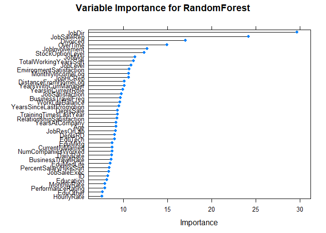<!-- -->

For our next algorithm, boosting, will use C5.0

``` r
set.seed(123)
C5 = train(Attrition~., data = train_f, method = 'C5.0', trControl = control)
```

    ## Warning: 'trials' should be <= 8 for this object. Predictions generated using 8
    ## trials
    
    ## Warning: 'trials' should be <= 8 for this object. Predictions generated using 8
    ## trials

    ## Warning: 'trials' should be <= 9 for this object. Predictions generated using 9
    ## trials
    
    ## Warning: 'trials' should be <= 9 for this object. Predictions generated using 9
    ## trials

    ## Warning: 'trials' should be <= 8 for this object. Predictions generated using 8
    ## trials
    
    ## Warning: 'trials' should be <= 8 for this object. Predictions generated using 8
    ## trials

``` r
C5
```

    ## C5.0 
    ## 
    ## 870 samples
    ##  41 predictor
    ##   2 classes: 'No', 'Yes' 
    ## 
    ## No pre-processing
    ## Resampling: Cross-Validated (10 fold, repeated 5 times) 
    ## Summary of sample sizes: 783, 782, 782, 784, 783, 783, ... 
    ## Resampling results across tuning parameters:
    ## 
    ##   model  winnow  trials  Accuracy   Kappa    
    ##   rules  FALSE    1      0.7490105  0.4975028
    ##   rules  FALSE   10      0.7935599  0.5869240
    ##   rules  FALSE   20      0.8105455  0.6209032
    ##   rules   TRUE    1      0.7533336  0.5061226
    ##   rules   TRUE   10      0.7834340  0.5663637
    ##   rules   TRUE   20      0.7868744  0.5734714
    ##   tree   FALSE    1      0.7257646  0.4509186
    ##   tree   FALSE   10      0.7988078  0.5974969
    ##   tree   FALSE   20      0.8133096  0.6265432
    ##   tree    TRUE    1      0.7391144  0.4778691
    ##   tree    TRUE   10      0.7855211  0.5711359
    ##   tree    TRUE   20      0.7878041  0.5758237
    ## 
    ## Accuracy was used to select the optimal model using the largest value.
    ## The final values used for the model were trials = 20, model = tree and winnow
    ##  = FALSE.

View feature importance for C5.0

``` r
plot(varImp(C5, scale = FALSE), main = 'Variable Importance for C5.0')
```

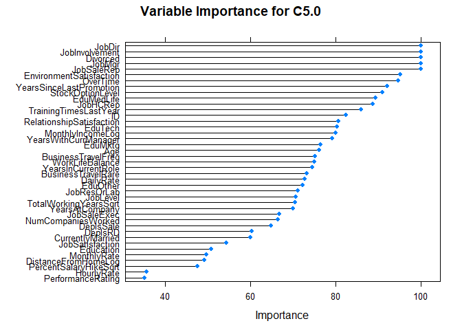<!-- -->

Our last algorithm, stacking, will use 5 base models

``` r
set.seed(123)
algorithms = c('naive_bayes', 'knn', 'rpart', 'svmRadial', 'glmnet')
set.seed(123)
models = caretList(Attrition~., data=train_f, trControl=control, methodList=algorithms)
```

    ## Warning in trControlCheck(x = trControl, y = target): x$savePredictions == TRUE
    ## is depreciated. Setting to 'final' instead.

    ## Warning in trControlCheck(x = trControl, y = target): indexes not defined in
    ## trControl. Attempting to set them ourselves, so each model in the ensemble will
    ## have the same resampling indexes.

``` r
summary(models)
```

    ##             Length Class Mode
    ## naive_bayes 23     train list
    ## knn         23     train list
    ## rpart       23     train list
    ## svmRadial   23     train list
    ## glmnet      23     train list

View each model’s performance

``` r
ans = resamples(models) #resamples helps to tabularize the results
summary(ans)
```

    ## 
    ## Call:
    ## summary.resamples(object = ans)
    ## 
    ## Models: naive_bayes, knn, rpart, svmRadial, glmnet 
    ## Number of resamples: 50 
    ## 
    ## Accuracy 
    ##                  Min.   1st Qu.    Median      Mean   3rd Qu.      Max. NA's
    ## naive_bayes 0.7386364 0.8023256 0.8181818 0.8241490 0.8505747 0.8863636    0
    ## knn         0.3977273 0.4842281 0.5229915 0.5200399 0.5619487 0.6206897    0
    ## rpart       0.6136364 0.7073864 0.7471264 0.7403619 0.7816092 0.8181818    0
    ## svmRadial   0.6744186 0.7377706 0.7701149 0.7693801 0.8023256 0.8620690    0
    ## glmnet      0.6162791 0.6869487 0.7069239 0.7105782 0.7378853 0.7816092    0
    ## 
    ## Kappa 
    ##                   Min.     1st Qu.     Median       Mean   3rd Qu.      Max.
    ## naive_bayes  0.4767322  0.60292759 0.63579772 0.64814191 0.7016156 0.7728446
    ## knn         -0.2145833 -0.03688982 0.04467741 0.03533806 0.1149076 0.2350120
    ## rpart        0.2324269  0.41516432 0.49244200 0.48089428 0.5625229 0.6365514
    ## svmRadial    0.3449402  0.47629166 0.54222544 0.53813298 0.6045441 0.7238095
    ## glmnet       0.2308943  0.37586460 0.41431441 0.42061526 0.4740215 0.5630452
    ##             NA's
    ## naive_bayes    0
    ## knn            0
    ## rpart          0
    ## svmRadial      0
    ## glmnet         0

Naive Bayes returned the highest median accuracy, while knn returned the
lowest by a considerable margin.

The outputs from each of the base models will serve as our new features.
We will use logistic regression to essentially highlight model strengths

``` r
set.seed(123)
stack.glm = caretStack(models, method="glm", metric="Accuracy", trControl=control)
print(stack.glm)
```

    ## A glm ensemble of 5 base models: naive_bayes, knn, rpart, svmRadial, glmnet
    ## 
    ## Ensemble results:
    ## Generalized Linear Model 
    ## 
    ## 4350 samples
    ##    5 predictor
    ##    2 classes: 'No', 'Yes' 
    ## 
    ## No pre-processing
    ## Resampling: Cross-Validated (10 fold, repeated 5 times) 
    ## Summary of sample sizes: 3914, 3914, 3916, 3915, 3915, 3916, ... 
    ## Resampling results:
    ## 
    ##   Accuracy   Kappa    
    ##   0.8393582  0.6784945

``` r
set.seed(123)
```

Finally, we will transform “yes” and “no” to 1 and 0. Then, create a
dataframe with each prediction of the three meta-algorithms.

``` r
num_pred = function(m){
  temp = predict(m, test_f)
  temp =  as.numeric(temp)
  temp[temp==1] = 0
  temp[temp==2] = 1
  return(temp)
}

rf_pred = num_pred(rf)
C5_pred = num_pred(C5)
stack_pred = num_pred(stack.glm)

all_pred = as.data.frame(cbind(rf_pred, C5_pred, stack_pred))
head(all_pred)
```

    ##   rf_pred C5_pred stack_pred
    ## 1       0       0          0
    ## 2       0       0          0
    ## 3       1       1          1
    ## 4       1       0          0
    ## 5       0       0          0
    ## 6       0       0          0

Take the majority for our final choice. Then transform 1/0 back to
Yes/No and assess our accuracy

``` r
final_pred = as.numeric(apply(all_pred[,1:3],1,function(x) names(which.max(table(x)))))
test_f <- test_f %>% mutate(AttritionBinary = ifelse(grepl("Yes", test_f$Attrition), 1,0))
confusionMatrix(table(final_pred,test_f$AttritionBinary))
```

    ## Confusion Matrix and Statistics
    ## 
    ##           
    ## final_pred   0   1
    ##          0 157   6
    ##          1  21  34
    ##                                           
    ##                Accuracy : 0.8761          
    ##                  95% CI : (0.8249, 0.9168)
    ##     No Information Rate : 0.8165          
    ##     P-Value [Acc > NIR] : 0.011578        
    ##                                           
    ##                   Kappa : 0.6391          
    ##                                           
    ##  Mcnemar's Test P-Value : 0.007054        
    ##                                           
    ##             Sensitivity : 0.8820          
    ##             Specificity : 0.8500          
    ##          Pos Pred Value : 0.9632          
    ##          Neg Pred Value : 0.6182          
    ##              Prevalence : 0.8165          
    ##          Detection Rate : 0.7202          
    ##    Detection Prevalence : 0.7477          
    ##       Balanced Accuracy : 0.8660          
    ##                                           
    ##        'Positive' Class : 0               
    ## 

# Recreate Model to Predict Attrition

Now, we will reproduce the above steps except for a test set that does
not list attrition. My professor will evaluate my final accuracy score
with the true values.

``` r
employeetest <- read.csv(file = 'Data_Sets\\CaseStudy2CompSet No Attrition.csv', header = T)
employeetest$Attrition <- NA
employeesubmissionraw <- rbind(employee, employeetest)
```

Add the transformed variables to our main df and remove the original
versions, along with the 1 level features and employeeNumber

``` r
employeesubmission <- employeesubmissionraw
employeesubmission <- employeesubmission %>% mutate(MonthlyIncomeLog = log(MonthlyIncome))
employeesubmission <- employeesubmission %>% mutate(PercentSalaryHikeSqrt = sqrt(PercentSalaryHike)) 
employeesubmission <- employeesubmission %>% mutate(TotalWorkingYearsSqrt = sqrt(TotalWorkingYears)) 
employeesubmission <- employeesubmission %>% mutate(DistanceFromHomeLog = log(DistanceFromHome))
employeesubmission <- subset(employeesubmission, select = -c(BusinessTravel, Department, EducationField, Gender,JobRole, MaritalStatus, Over18, OverTime, MonthlyIncome, PercentSalaryHike, TotalWorkingYears, DistanceFromHome, StandardHours, EmployeeCount, EmployeeNumber))
```

``` r
catsub <- employeesubmissionraw %>% select(Attrition,BusinessTravel,Department,EducationField,Gender,JobRole,MaritalStatus,Over18,OverTime,ID)

# rename catsubegories so they are more compact in the pivot table
catsub$JobRole[catsub$JobRole == "Sales Executive"] <- "SaleExec"
catsub$JobRole[catsub$JobRole == "Research Director"] <- "RsrDir"
catsub$JobRole[catsub$JobRole == "Manufacturing Director"] <- "ManDir"
catsub$JobRole[catsub$JobRole == "Research Scientist"] <- "RsrSci"
catsub$JobRole[catsub$JobRole == "Sales Representative"] <- "SaleRep"
catsub$JobRole[catsub$JobRole == "Healthcare Representative"] <- "HCRep"
catsub$JobRole[catsub$JobRole == "Manager"] <- "Mgr"
catsub$JobRole[catsub$JobRole == "Human Resources"] <- "HR"
catsub$JobRole[catsub$JobRole == "Laboratory Technician"] <- "LabTec"
catsub$EducationField[catsub$EducationField == "Life Sciences"] <- "LifeSci"
catsub$EducationField[catsub$EducationField == "Medical"] <- "Med"
catsub$EducationField[catsub$EducationField == "Marketing"] <- "Mktg"
catsub$EducationField[catsub$EducationField == "Technical Degree"] <- "TechDeg"
catsub$EducationField[catsub$EducationField == "Human Resources"] <- "HR"

# EducationField
catsub <- catsub %>% mutate(EduMedLife = ifelse(grepl("LifeSci", catsub$EducationField), 1, ifelse(grepl("Med", catsub$EducationField), 1, 0)))
catsub <- catsub %>% mutate(EduMktg = ifelse(grepl("Mktg", catsub$EducationField), 1,0))
catsub <- catsub %>% mutate(EduTech = ifelse(grepl("TechDeg", catsub$EducationField), 1,0))
catsub <- catsub %>% mutate(EduOther = ifelse(grepl("Other", catsub$EducationField), 1,0))
# EducationField is the reference group

# JobRole
catsub$JobDir <- 0
catsub$JobDir[catsub$JobRole == "ManDir" | catsub$JobRole == "RsrDir"] <- 1

catsub$JobResOrLab <- 0
catsub$JobResOrLab[catsub$JobRole == "LabTec" | catsub$JobRole == "RsrSci"] <- 1

catsub <- catsub %>% mutate(JobMgr = ifelse(grepl("Mgr", catsub$JobRole), 1,0))
catsub <- catsub %>% mutate(JobHCRep = ifelse(grepl("HCRep", catsub$JobRole), 1,0))
catsub <- catsub %>% mutate(JobSaleRep = ifelse(grepl("SaleRep", catsub$JobRole), 1,0))
catsub <- catsub %>% mutate(JobSaleExec = ifelse(grepl("SaleExec", catsub$JobRole), 1,0))
# HR is the reference group

# Department 
catsub <- catsub %>% mutate(DepIsRD = ifelse(grepl("Research & Development", catsub$Department), 1,0))
catsub <- catsub %>% mutate(DepIsSale = ifelse(grepl("Sales", catsub$Department), 1,0))
# Human Resources is the reference group

# BusinessTravel
catsub <- catsub %>% mutate(BusinessTravelRare = ifelse(grepl("Travel_Rarely", catsub$BusinessTravel), 1,0))
catsub <- catsub %>% mutate(BusinessTravelFreq = ifelse(grepl("Travel_Frequently", catsub$BusinessTravel), 1,0))
# Non-Travel is the reference

# MaritalStatus has 3 catsubegories, so we will do make 2 dummy columns
catsub <- catsub %>% mutate(CurrentlyMarried = ifelse(grepl("Married", catsub$MaritalStatus), 1,0))
catsub <- catsub %>% mutate(Divorced = ifelse(grepl("Divorced", catsub$MaritalStatus), 1,0))

# OverTime
catsub$OverTime[catsub$OverTime == "No"] <- 0
catsub$OverTime[catsub$OverTime == "Yes"] <- 1
catsub$OverTime <- as.integer(catsub$OverTime)

catsub <- subset(catsub, select = -c(1,2,3,4,5,6,7,8))
```

``` r
employeesubmission <- merge(catsub, employeesubmission, by = "ID")

for(num in 21:42) {      
  employeesubmission[ , num] <- scale(employeesubmission[ , num])
}
employeesubmission$Age <- scale(employeesubmission$Age)

employeesubmission[,21:42] <- sapply(employeesubmission[,21:42],as.numeric)
employeesubmission$Age <- as.numeric(employeesubmission$Age)


train_f = employeesubmission[1:870,]
train_f <- ROSE(Attrition ~ . -ID, data = employeesubmission, seed = 123)$data
```

    ## Warning in omnibus.balancing(formula, data, subset, na.action, N, p, method = "rose", : Transformations of variables are not allowed.
    ##  New data have been generated by using non-transformed variables.
    ## 

``` r
test_f = employeesubmission[871:1170,]
```

We can see our Attrition distribution is much more balanced now

``` r
train_f %>% group_by(Attrition) %>% summarise(count = n())
```

    ## `summarise()` ungrouping output (override with `.groups` argument)

    ## # A tibble: 2 x 2
    ##   Attrition count
    ##   <chr>     <int>
    ## 1 No          447
    ## 2 Yes         423

Our model will be an ensemble of three meta-algorithms - bagging,
boosting, and stacking. We will then hard vote to make our final
prediction.

For our first algorithm, bagging, we will use random forest. We will
create a control variable to specify the sampling techniques. We will
set the method to be cross validation.

``` r
set.seed(123)
control = trainControl(method="repeatedcv", number=10, repeats=5, savePredictions=TRUE, classProbs=TRUE)
rf = train(Attrition~., data = train_f, method = 'rf', metric = 'Accuracy', trControl = control)
rf
```

    ## Random Forest 
    ## 
    ## 870 samples
    ##  41 predictor
    ##   2 classes: 'No', 'Yes' 
    ## 
    ## No pre-processing
    ## Resampling: Cross-Validated (10 fold, repeated 5 times) 
    ## Summary of sample sizes: 783, 782, 782, 784, 783, 783, ... 
    ## Resampling results across tuning parameters:
    ## 
    ##   mtry  Accuracy   Kappa    
    ##    2    0.8277663  0.6551798
    ##   21    0.8146920  0.6293638
    ##   41    0.8038998  0.6081201
    ## 
    ## Accuracy was used to select the optimal model using the largest value.
    ## The final value used for the model was mtry = 2.

View feature importance for Random Forest

``` r
plot(varImp(rf, scale = FALSE), main = 'Variable Importance for RandomForest')
```

<!-- -->

For our next algorithm, boosting, will use C5.0

``` r
set.seed(123)
C5 = train(Attrition~., data = train_f, method = 'C5.0', trControl = control)
```

    ## Warning: 'trials' should be <= 8 for this object. Predictions generated using 8
    ## trials
    
    ## Warning: 'trials' should be <= 8 for this object. Predictions generated using 8
    ## trials

    ## Warning: 'trials' should be <= 9 for this object. Predictions generated using 9
    ## trials
    
    ## Warning: 'trials' should be <= 9 for this object. Predictions generated using 9
    ## trials

    ## Warning: 'trials' should be <= 8 for this object. Predictions generated using 8
    ## trials
    
    ## Warning: 'trials' should be <= 8 for this object. Predictions generated using 8
    ## trials

``` r
C5
```

    ## C5.0 
    ## 
    ## 870 samples
    ##  41 predictor
    ##   2 classes: 'No', 'Yes' 
    ## 
    ## No pre-processing
    ## Resampling: Cross-Validated (10 fold, repeated 5 times) 
    ## Summary of sample sizes: 783, 782, 782, 784, 783, 783, ... 
    ## Resampling results across tuning parameters:
    ## 
    ##   model  winnow  trials  Accuracy   Kappa    
    ##   rules  FALSE    1      0.7490105  0.4975028
    ##   rules  FALSE   10      0.7935599  0.5869240
    ##   rules  FALSE   20      0.8105455  0.6209032
    ##   rules   TRUE    1      0.7533336  0.5061226
    ##   rules   TRUE   10      0.7834340  0.5663637
    ##   rules   TRUE   20      0.7868744  0.5734714
    ##   tree   FALSE    1      0.7257646  0.4509186
    ##   tree   FALSE   10      0.7988078  0.5974969
    ##   tree   FALSE   20      0.8133096  0.6265432
    ##   tree    TRUE    1      0.7391144  0.4778691
    ##   tree    TRUE   10      0.7855211  0.5711359
    ##   tree    TRUE   20      0.7878041  0.5758237
    ## 
    ## Accuracy was used to select the optimal model using the largest value.
    ## The final values used for the model were trials = 20, model = tree and winnow
    ##  = FALSE.

View feature importance for C5.0

``` r
plot(varImp(C5, scale = FALSE), main = 'Variable Importance for C5.0')
```

<!-- -->

Our last algorithm, stacking, will use 5 base models

``` r
set.seed(123)
algorithms = c('naive_bayes', 'knn', 'rpart', 'svmRadial', 'glmnet')
set.seed(123)
models = caretList(Attrition~., data=train_f, trControl=control, methodList=algorithms)
```

    ## Warning in trControlCheck(x = trControl, y = target): x$savePredictions == TRUE
    ## is depreciated. Setting to 'final' instead.

    ## Warning in trControlCheck(x = trControl, y = target): indexes not defined in
    ## trControl. Attempting to set them ourselves, so each model in the ensemble will
    ## have the same resampling indexes.

``` r
summary(models)
```

    ##             Length Class Mode
    ## naive_bayes 23     train list
    ## knn         23     train list
    ## rpart       23     train list
    ## svmRadial   23     train list
    ## glmnet      23     train list

View each model’s performance

``` r
ans = resamples(models) #resamples helps to tabularize the results
summary(ans)
```

    ## 
    ## Call:
    ## summary.resamples(object = ans)
    ## 
    ## Models: naive_bayes, knn, rpart, svmRadial, glmnet 
    ## Number of resamples: 50 
    ## 
    ## Accuracy 
    ##                  Min.   1st Qu.    Median      Mean   3rd Qu.      Max. NA's
    ## naive_bayes 0.7386364 0.8023256 0.8181818 0.8241490 0.8505747 0.8863636    0
    ## knn         0.3977273 0.4884382 0.5229915 0.5204917 0.5581395 0.6321839    0
    ## rpart       0.6136364 0.7073864 0.7471264 0.7403619 0.7816092 0.8181818    0
    ## svmRadial   0.6744186 0.7377706 0.7701149 0.7693801 0.8023256 0.8620690    0
    ## glmnet      0.6162791 0.6869487 0.7069239 0.7105782 0.7378853 0.7816092    0
    ## 
    ## Kappa 
    ##                   Min.     1st Qu.     Median       Mean   3rd Qu.      Max.
    ## naive_bayes  0.4767322  0.60292759 0.63579772 0.64814191 0.7016156 0.7728446
    ## knn         -0.2145833 -0.03072799 0.04170374 0.03602684 0.1149076 0.2587859
    ## rpart        0.2324269  0.41516432 0.49244200 0.48089428 0.5625229 0.6365514
    ## svmRadial    0.3449402  0.47629166 0.54222544 0.53813298 0.6045441 0.7238095
    ## glmnet       0.2308943  0.37586460 0.41431441 0.42061526 0.4740215 0.5630452
    ##             NA's
    ## naive_bayes    0
    ## knn            0
    ## rpart          0
    ## svmRadial      0
    ## glmnet         0

Naive Bayes returned the highest median accuracy, while knn returned the
lowest by a considerable margin.

The outputs from each of the base models will serve as our new features.
We will use logistic regression to essentially highlight model strengths

``` r
set.seed(123)
stack.glm = caretStack(models, method="glm", metric="Accuracy", trControl=control)
print(stack.glm)
```

    ## A glm ensemble of 5 base models: naive_bayes, knn, rpart, svmRadial, glmnet
    ## 
    ## Ensemble results:
    ## Generalized Linear Model 
    ## 
    ## 4350 samples
    ##    5 predictor
    ##    2 classes: 'No', 'Yes' 
    ## 
    ## No pre-processing
    ## Resampling: Cross-Validated (10 fold, repeated 5 times) 
    ## Summary of sample sizes: 3914, 3914, 3916, 3915, 3915, 3916, ... 
    ## Resampling results:
    ## 
    ##   Accuracy   Kappa    
    ##   0.8393583  0.6784975

``` r
set.seed(123)
```

Finally, we will transform “yes” and “no” to 1 and 0. Then, create a
dataframe with each prediction of the three meta-algorithms.

``` r
num_pred = function(m){
  temp = predict(m, test_f)
  temp =  as.numeric(temp)
  temp[temp==1] = 0
  temp[temp==2] = 1
  return(temp)
}

rf_pred = num_pred(rf)
C5_pred = num_pred(C5)
stack_pred = num_pred(stack.glm)

all_pred = as.data.frame(cbind(rf_pred, C5_pred, stack_pred))
head(all_pred)
```

    ##   rf_pred C5_pred stack_pred
    ## 1       0       0          0
    ## 2       0       0          0
    ## 3       0       0          0
    ## 4       0       0          0
    ## 5       0       0          0
    ## 6       0       0          0

Take the majority for our final choice. Then transform 1/0 back to
Yes/No and produce final predictions

``` r
final_pred = as.numeric(apply(all_pred[,1:3],1,function(x) names(which.max(table(x)))))
test_f <- test_f %>% mutate(AttritionBinary = ifelse(grepl("Yes", test_f$Attrition), 1,0))

ID <- employeesubmissionraw$ID[871:1170]
submission <- data.frame(ID, Attrition = final_pred)

submission$Attrition[submission$Attrition == 1] <- "Yes"
submission$Attrition[submission$Attrition == 0] <- "No"

#write.csv(submission, "Data_Sets\\Case2PredictionsMazel_Salary.csv", row.names=F)
```

# Additional Exploration of Data

Investigate number of male/females in the company and in leadership
roles

``` r
employee %>% group_by(Gender) %>% summarise(count = n())
```

    ## `summarise()` ungrouping output (override with `.groups` argument)

    ## # A tibble: 2 x 2
    ##   Gender count
    ##   <chr>  <int>
    ## 1 Female   354
    ## 2 Male     516

``` r
employee %>% filter(JobRole == "Manufacturing Director" | JobRole == "Research Director" | JobRole == "Manager") %>% group_by(Gender) %>% summarise(count = n())
```

    ## `summarise()` ungrouping output (override with `.groups` argument)

    ## # A tibble: 2 x 2
    ##   Gender count
    ##   <chr>  <int>
    ## 1 Female    91
    ## 2 Male      98

Run a ttest to determine if there is a difference in monthly incomes
between males and females in leadership roles

``` r
employee_mgrdir <- employee %>% filter(JobRole == "Manufacturing Director" | JobRole == "Research Director" | JobRole == "Manager")

employee_mgrdir %>% filter(Gender == "Female") %>% ggplot(aes(x = MonthlyIncome)) + geom_histogram(fill = "#F8766D") + ggtitle("Monthly Income of Females in Leadership Positions")
```

    ## `stat_bin()` using `bins = 30`. Pick better value with `binwidth`.

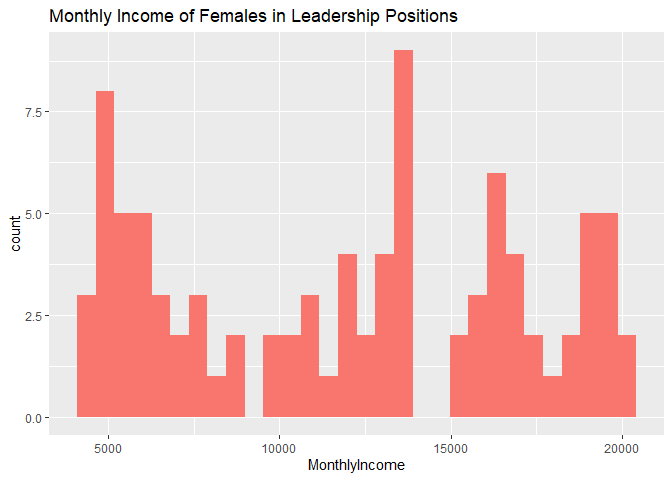<!-- -->

``` r
employee_mgrdir %>% filter(Gender == "Male") %>% ggplot(aes(x = MonthlyIncome)) + geom_histogram(fill = "#00BFC4") + ggtitle("Monthly Income of Males in Leadership Positions")
```

    ## `stat_bin()` using `bins = 30`. Pick better value with `binwidth`.

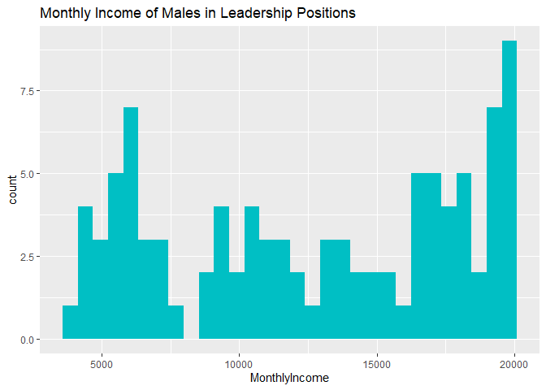<!-- -->

``` r
employee_mgrdir %>% filter(Gender == "Female") %>% ggplot(aes(x = MonthlyIncome)) + geom_histogram(aes(fill=JobRole)) + ggtitle("Monthly Income of Females in Leadership Positions")
```

    ## `stat_bin()` using `bins = 30`. Pick better value with `binwidth`.

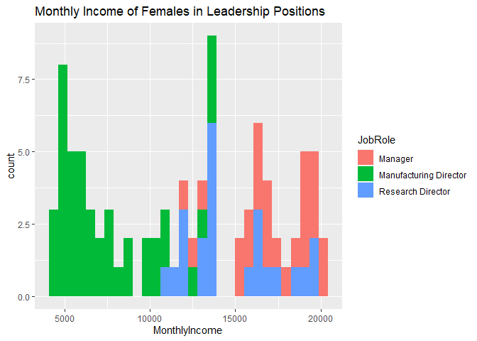<!-- -->

``` r
employee_mgrdir %>% filter(Gender == "Male") %>% ggplot(aes(x = MonthlyIncome)) + geom_histogram(aes(fill=JobRole)) + ggtitle("Monthly Income of Males in Leadership Positions")
```

    ## `stat_bin()` using `bins = 30`. Pick better value with `binwidth`.

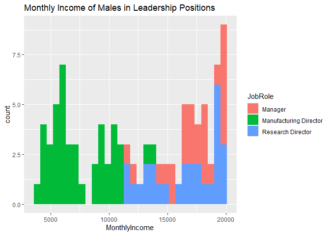<!-- -->

``` r
employee_mgrdir %>% ggplot(aes(x = MonthlyIncome, y = Gender)) + geom_boxplot(aes(fill=Gender)) + ggtitle("Boxplots of Monthly Incomes")
```

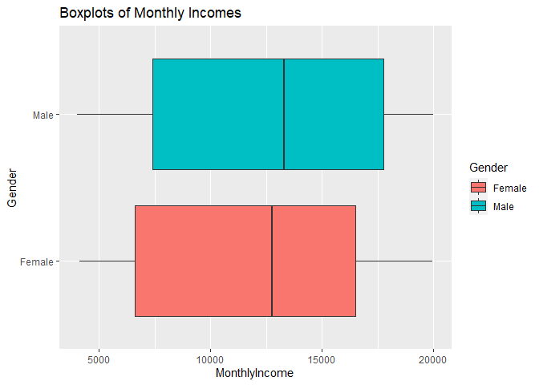<!-- -->

Not normally distributed, but no major skews present. Due to the central
limit theorem and large sample sizes, safe to proceed. The genders
display great equality of variance. Run a normal ttest

``` r
t.test(employee_mgrdir$MonthlyIncome ~ employee_mgrdir$Gender)
```

    ## 
    ##  Welch Two Sample t-test
    ## 
    ## data:  employee_mgrdir$MonthlyIncome by employee_mgrdir$Gender
    ## t = -0.89199, df = 186.61, p-value = 0.3735
    ## alternative hypothesis: true difference in means is not equal to 0
    ## 95 percent confidence interval:
    ##  -2179.2569   822.1533
    ## sample estimates:
    ## mean in group Female   mean in group Male 
    ##             11993.42             12671.97

``` r
employee %>% ggplot(aes(x = YearsAtCompany, y = MonthlyIncome)) + geom_jitter(aes(color=Attrition)) + facet_wrap(JobRole ~ .) + ggtitle("Job Roles - Years Working for the Company vs. Income")
```

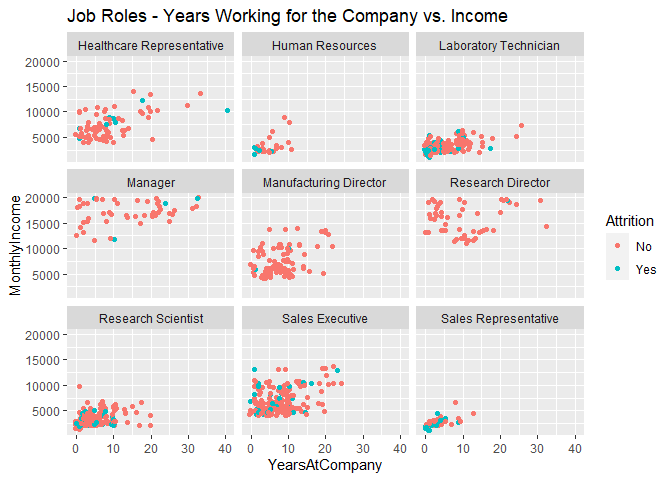<!-- -->

# Monthly Income Prediction with Regression

Import data

``` r
employee_raw <- read.csv(file = 'Data_Sets\\CaseStudy2-data.csv', header = TRUE, stringsAsFactors = TRUE)
employee <- employee_raw
employee <- subset(employee, select = -c(EmployeeCount, StandardHours))
```

First, we will see if we meet our linear regression assumptions. If
violated, perform log transformations and outlier removal where
necessary. Afterwards, we will use LASSO for variable selection

Recall from part 1 of the analysis:  
No null values found.  
Employee count and standard hours returned only 1 unique value each

Select data that includes quantitative variables.

``` r
quant <- subset(employee, select=-c(Attrition, BusinessTravel,Department,EducationField,Gender,JobRole,MaritalStatus,Over18,OverTime))
```

Check our linear regression assumptions first by looking at the
correlations

``` r
par(mfrow=c(2,3))
plot(quant$DistanceFromHome, quant$MonthlyIncome)
plot(quant$PercentSalaryHike, quant$MonthlyIncome)
plot(quant$TotalWorkingYears, quant$MonthlyIncome)
plot(quant$Age, quant$MonthlyIncome)
plot(quant$DailyRate, quant$MonthlyIncome)
plot(quant$Education, quant$MonthlyIncome)
```

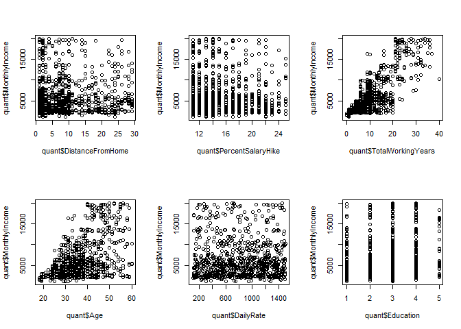<!-- -->

``` r
plot(quant$EnvironmentSatisfaction, quant$MonthlyIncome)
plot(quant$HourlyRate, quant$MonthlyIncome)
plot(quant$JobInvolvement, quant$MonthlyIncome)
plot(quant$JobLevel, quant$MonthlyIncome)
plot(quant$JobSatisfaction, quant$MonthlyIncome)
plot(quant$MonthlyRate, quant$MonthlyIncome)
```

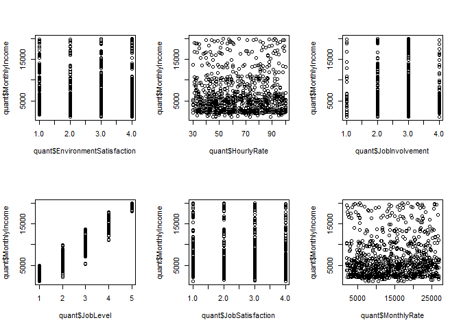<!-- -->

``` r
plot(quant$NumCompaniesWorked, quant$MonthlyIncome)
plot(quant$PerformanceRating, quant$MonthlyIncome)
plot(quant$RelationshipSatisfaction, quant$MonthlyIncome)
plot(quant$StockOptionLevel, quant$MonthlyIncome)
plot(quant$TrainingTimesLastYear, quant$MonthlyIncome)
plot(quant$WorkLifeBalance, quant$MonthlyIncome)
```

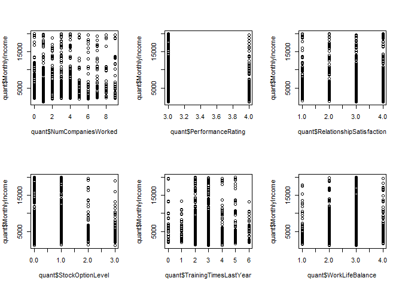<!-- -->

``` r
plot(quant$WorkLifeBalance, quant$MonthlyIncome)
plot(quant$YearsAtCompany, quant$MonthlyIncome)
plot(quant$YearsInCurrentRole, quant$MonthlyIncome)
plot(quant$YearsSinceLastPromotion, quant$MonthlyIncome)
```

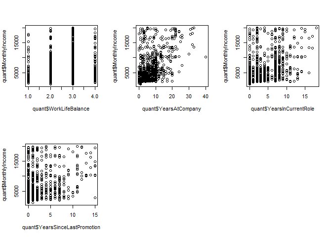<!-- -->

Let’s see how the residuals look.

``` r
fit = lm(data = quant, MonthlyIncome ~ . -ID)

par(mfrow=c(2,2))
plot(fit)
```

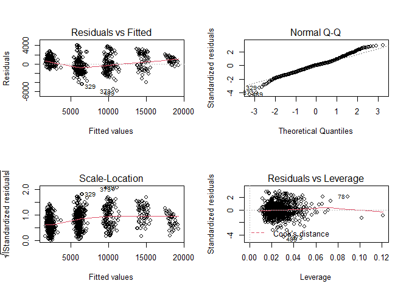<!-- -->

We will log transform monthly income to see if it benefits the model and
check the correlations again.

``` r
quant <- quant %>% mutate(MonthlyIncomeLog = log(MonthlyIncome))

par(mfrow=c(2,3))
plot(quant$DistanceFromHome, quant$MonthlyIncomeLog)
plot(quant$PercentSalaryHike, quant$MonthlyIncomeLog)
plot(quant$TotalWorkingYears, quant$MonthlyIncomeLog)
plot(quant$Age, quant$MonthlyIncomeLog)
plot(quant$DailyRate, quant$MonthlyIncomeLog)
plot(quant$Education, quant$MonthlyIncomeLog)
```

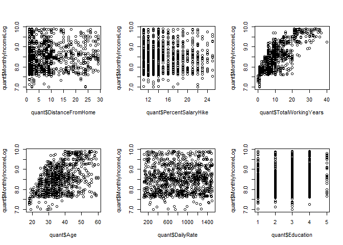<!-- -->

``` r
plot(quant$EnvironmentSatisfaction, quant$MonthlyIncomeLog)
plot(quant$HourlyRate, quant$MonthlyIncomeLog)
plot(quant$JobInvolvement, quant$MonthlyIncomeLog)
plot(quant$JobLevel, quant$MonthlyIncomeLog)
plot(quant$JobSatisfaction, quant$MonthlyIncomeLog)
plot(quant$MonthlyRate, quant$MonthlyIncomeLog)
```

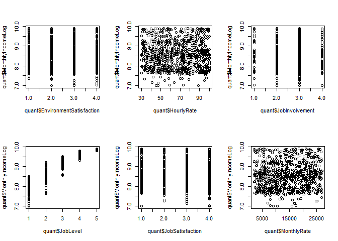<!-- -->

``` r
plot(quant$NumCompaniesWorked, quant$MonthlyIncomeLog)
plot(quant$PerformanceRating, quant$MonthlyIncomeLog)
plot(quant$RelationshipSatisfaction, quant$MonthlyIncomeLog)
plot(quant$StockOptionLevel, quant$MonthlyIncomeLog)
plot(quant$TrainingTimesLastYear, quant$MonthlyIncomeLog)
plot(quant$WorkLifeBalance, quant$MonthlyIncomeLog)
```

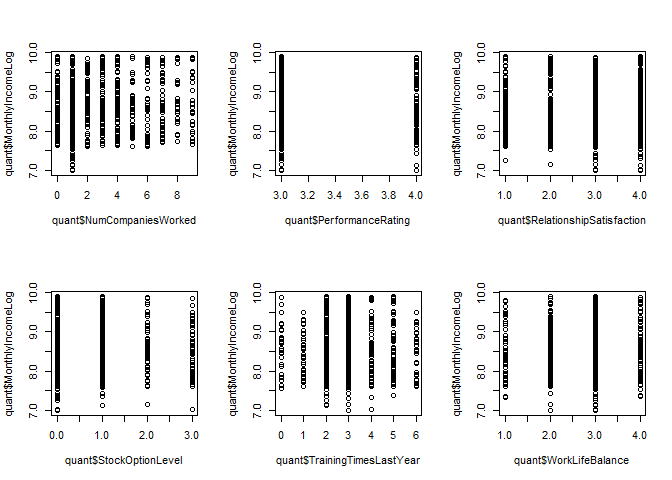<!-- -->

``` r
plot(quant$WorkLifeBalance, quant$MonthlyIncomeLog)
plot(quant$YearsAtCompany, quant$MonthlyIncomeLog)
plot(quant$YearsInCurrentRole, quant$MonthlyIncomeLog)
plot(quant$YearsSinceLastPromotion, quant$MonthlyIncomeLog)
```

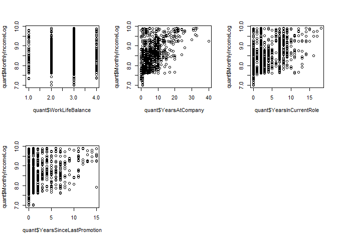<!-- -->

Additionally, transform some explanatory variables to see if it improves
the linear relationship with monthly income

``` r
quant <- quant %>% mutate(DistanceFromHomeLog = log(DistanceFromHome))
quant <- quant %>% mutate(TotalWorkingYearsLog = log(TotalWorkingYears))
quant <- quant %>% mutate(AgeLog = log(Age))
quant <- quant %>% mutate(JobLevelLog = log(JobLevel))
quant <- quant %>% mutate(YearsAtCompanyLog = log(YearsAtCompany))
quant <- quant %>% mutate(YearsSinceLastPromotionLog = log(YearsSinceLastPromotion))

par(mfrow=c(2,3))
plot(quant$DistanceFromHomeLog, quant$MonthlyIncomeLog)
plot(quant$TotalWorkingYearsLog, quant$MonthlyIncomeLog)
plot(quant$AgeLog, quant$MonthlyIncomeLog)
plot(quant$JobLevelLog, quant$MonthlyIncomeLog)
plot(quant$YearsAtCompanyLog, quant$MonthlyIncomeLog)
plot(quant$YearsSinceLastPromotionLog, quant$MonthlyIncomeLog)
```

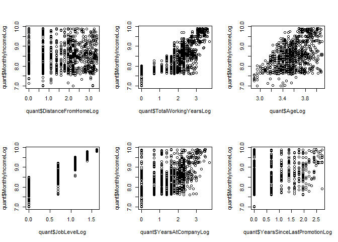<!-- -->

JobLevel looks more linear when logged, but none of the rest seem to
improve. Let’s check the residuals again

``` r
quant <- subset(quant, select = -c(DistanceFromHomeLog, TotalWorkingYearsLog, AgeLog, YearsAtCompanyLog, YearsSinceLastPromotionLog, JobLevel))

fit = lm(data = quant, MonthlyIncome ~ . -ID -MonthlyIncomeLog)
par(mfrow=c(2,2))
plot(fit)
```

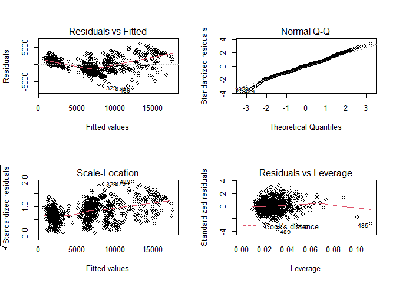<!-- -->

``` r
fit = lm(data = quant, MonthlyIncomeLog ~ . -ID -MonthlyIncome)
par(mfrow=c(2,2))
plot(fit)
```

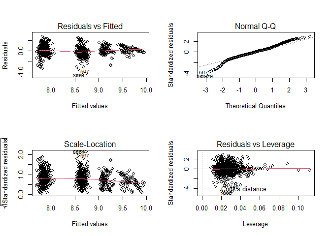<!-- -->

The first set of plots uses the original monthly income response
variable, and the second plot is with its logged transformation. The
original version outperforms in the qq plot. The logged version,
however, produces a flatter residual distribution line. We will stick
with the logged version. The assumptions are not perfect, but we will
proceed with caution.

Now, we will split the data into train and test sets. We will use LASSO
for our variable selection.

``` r
library(glmnet)
```

    ## Warning: package 'glmnet' was built under R version 4.0.5

    ## Loading required package: Matrix

    ## 
    ## Attaching package: 'Matrix'

    ## The following objects are masked from 'package:tidyr':
    ## 
    ##     expand, pack, unpack

    ## Loaded glmnet 4.1-1

``` r
# https://rstatisticsblog.com/data-science-in-action/machine-learning/lasso-regression/

quant <- subset(quant, select = -c(MonthlyIncome))

# Splitting the data into test and train
set.seed(123)
train = quant[1:652,]

train_x = subset(train, select = -c(MonthlyIncomeLog))
train_y = train$MonthlyIncomeLog
train_x <- data.matrix(train_x) #cv.glmnet requires matrix, not a df

lambda_seq <- 10^seq(2, -2, by = -.1)
cv_output <- cv.glmnet(train_x, train_y)
 
# identifying best lambda
best_lam <- cv_output$lambda.min
best_lam
```

    ## [1] 0.01364409

See the selected features

``` r
lasso_best_fit <- glmnet(train_x, train_y, lambda = best_lam)
coef(lasso_best_fit)
```

    ## 25 x 1 sparse Matrix of class "dgCMatrix"
    ##                                   s0
    ## (Intercept)              7.788486592
    ## ID                       .          
    ## Age                      .          
    ## DailyRate                .          
    ## DistanceFromHome         .          
    ## Education                .          
    ## EmployeeNumber           .          
    ## EnvironmentSatisfaction  .          
    ## HourlyRate               .          
    ## JobInvolvement           0.005684858
    ## JobSatisfaction          .          
    ## MonthlyRate              .          
    ## NumCompaniesWorked       .          
    ## PercentSalaryHike        .          
    ## PerformanceRating        .          
    ## RelationshipSatisfaction .          
    ## StockOptionLevel         .          
    ## TotalWorkingYears        0.010484687
    ## TrainingTimesLastYear    .          
    ## WorkLifeBalance          .          
    ## YearsAtCompany           .          
    ## YearsInCurrentRole       .          
    ## YearsSinceLastPromotion  .          
    ## YearsWithCurrManager     .          
    ## JobLevelLog              1.064471236

See the model’s performance and double check the assumptions

``` r
fit <- lm(data = quant, MonthlyIncomeLog ~ JobLevelLog + TotalWorkingYears + JobInvolvement)
summary(fit)
```

    ## 
    ## Call:
    ## lm(formula = MonthlyIncomeLog ~ JobLevelLog + TotalWorkingYears + 
    ##     JobInvolvement, data = quant)
    ## 
    ## Residuals:
    ##      Min       1Q   Median       3Q      Max 
    ## -1.11242 -0.12980 -0.00096  0.13207  0.66279 
    ## 
    ## Coefficients:
    ##                   Estimate Std. Error t value Pr(>|t|)    
    ## (Intercept)       7.732784   0.034237 225.862  < 2e-16 ***
    ## JobLevelLog       1.076617   0.023076  46.656  < 2e-16 ***
    ## TotalWorkingYears 0.011496   0.001574   7.302 6.41e-13 ***
    ## JobInvolvement    0.019878   0.011371   1.748   0.0808 .  
    ## ---
    ## Signif. codes:  0 '***' 0.001 '**' 0.01 '*' 0.05 '.' 0.1 ' ' 1
    ## 
    ## Residual standard error: 0.2358 on 866 degrees of freedom
    ## Multiple R-squared:  0.8734, Adjusted R-squared:  0.8729 
    ## F-statistic:  1991 on 3 and 866 DF,  p-value: < 2.2e-16

``` r
par(mfrow=c(2,2))
plot(fit)
```

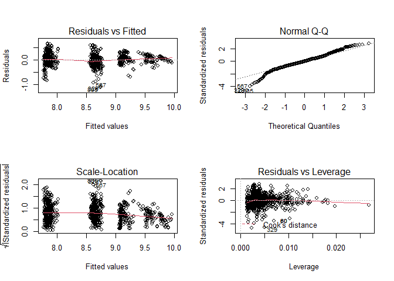<!-- -->

``` r
quant2 <- subset(quant, select = c(MonthlyIncomeLog, JobLevelLog, TotalWorkingYears, JobInvolvement))
chart.Correlation(quant2, histogram=TRUE, pch=19)
```

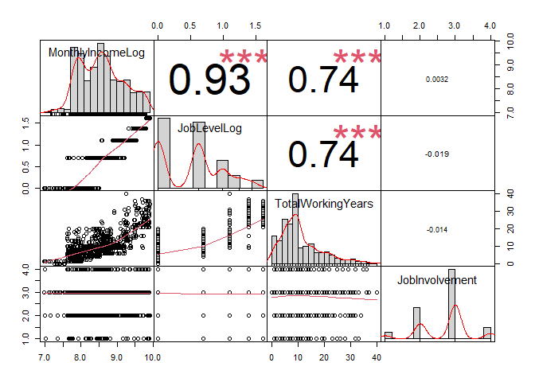<!-- -->

With the the three explanatory variables, the model produced a .8729
adjusted r squared. Let’s see our model’s RMSE on the test set.

``` r
test <- quant[653:870,]
test <- subset(test, select = c(JobLevelLog, TotalWorkingYears, JobInvolvement))
test_predict <- exp(predict(fit, newdata = test)) # reverses the log transformation
test_actual <- employee_raw$MonthlyIncome[653:870]

predictions <- data.frame(test_actual, test_predict)

library(Metrics)
```

    ## Warning: package 'Metrics' was built under R version 4.0.5

    ## 
    ## Attaching package: 'Metrics'

    ## The following objects are masked from 'package:caret':
    ## 
    ##     precision, recall

``` r
rmse(predictions$test_actual, predictions$test_predict)
```

    ## [1] 1356.325

Now, we will predict a test set that does not list monthly income. My
professor will evaluate the final RMSE with the true values.

``` r
employee_final <- read.csv(file = 'Data_Sets\\CaseStudy2CompSet No Salary.csv', header = TRUE, stringsAsFactors = TRUE)
employee_final$MonthlyIncomeLog <- NA
employee_final <- employee_final %>% mutate(TotalWorkingYearsLog = log(TotalWorkingYears))
employee_final <- employee_final %>% mutate(JobLevelLog = log(JobLevel))
employee_final <- employee_final %>% mutate(JobInvolvementLog = log(JobInvolvement))
employee_final <- subset(employee_final, select = c(ID, MonthlyIncomeLog, JobLevelLog, TotalWorkingYears, JobInvolvement))

test_predict <- exp(predict(fit, newdata = employee_final))
test_predict <- data.frame(Id = employee_final$ID, MonthlyIncome = test_predict)

#write.csv(test_predict, "Data_Sets\\Case2PredictionsMazel_Attrition.csv", row.names=F)
```
